

  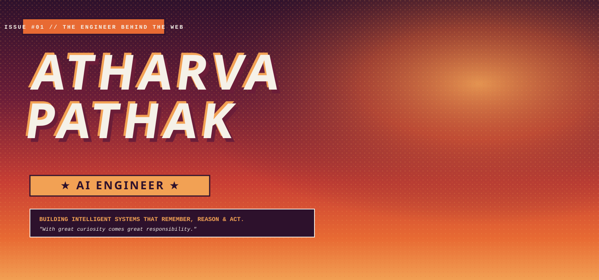

<!-- SCENE 01: ORIGIN STORY -->

  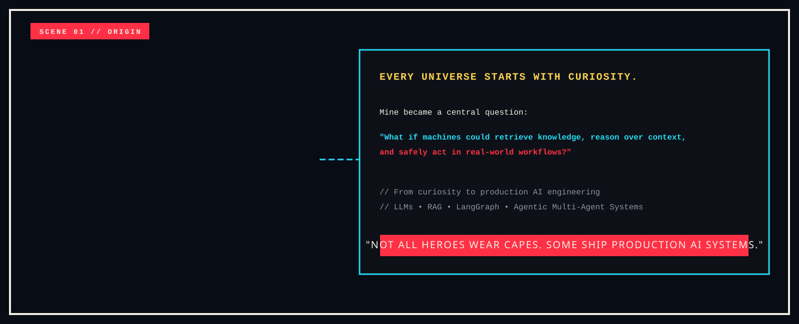

<!-- SCENE 02: CHARACTER DOSSIER WITH SPIDER-VERSE HERO SILHOUETTE -->

  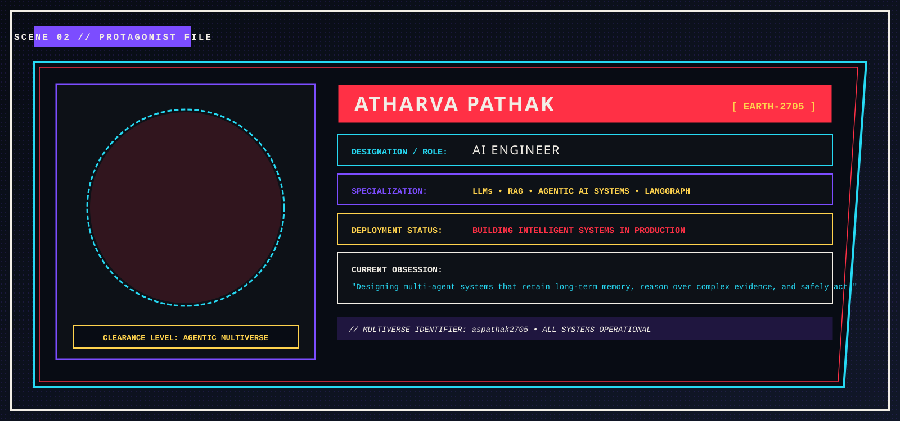

<!-- SCENE 03: TECH MULTIVERSE MAP -->

  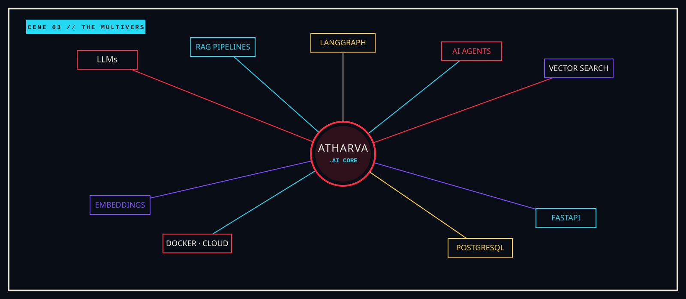

<!-- SCENE 04: PROJECT MULTIVERSES (PORTALS) -->

  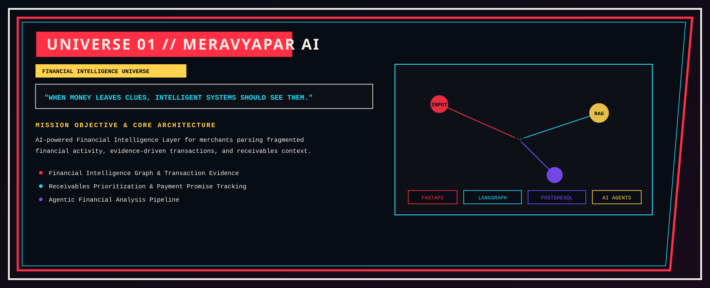

  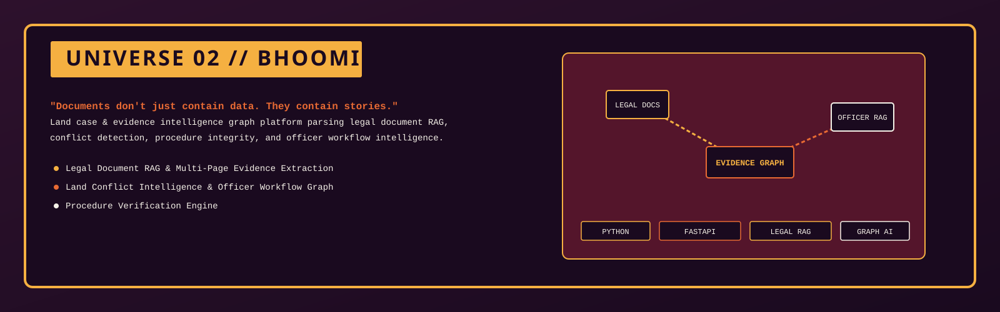

  

  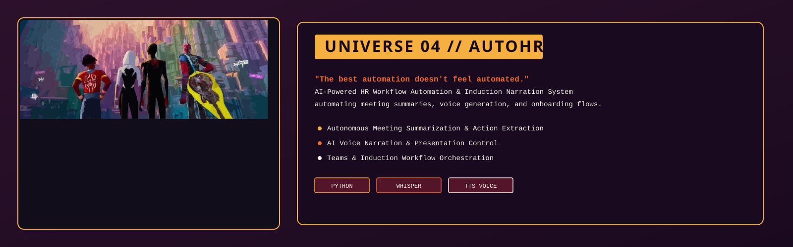

<!-- SCENE 05: AGENTIC AI PHILOSOPHY FLOW -->

  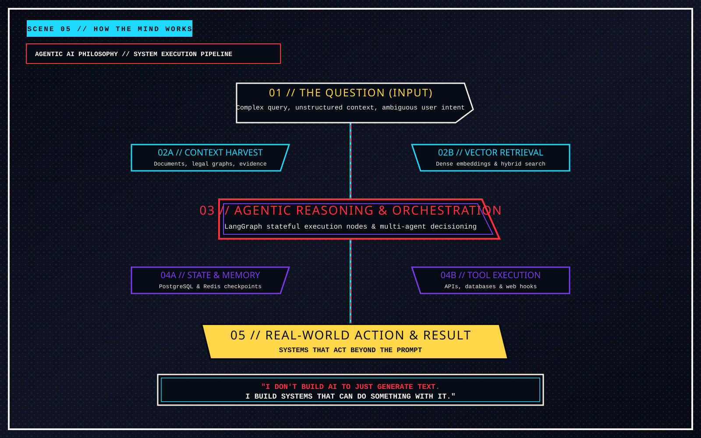

<!-- SCENE 06: MISSION CONTROL -->

  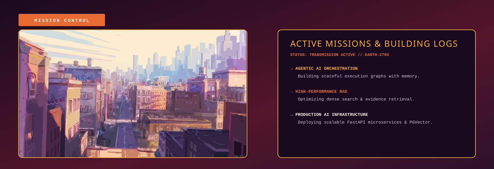

<!-- SCENE 07: MULTIVERSE CITY & DISTRICTS -->

  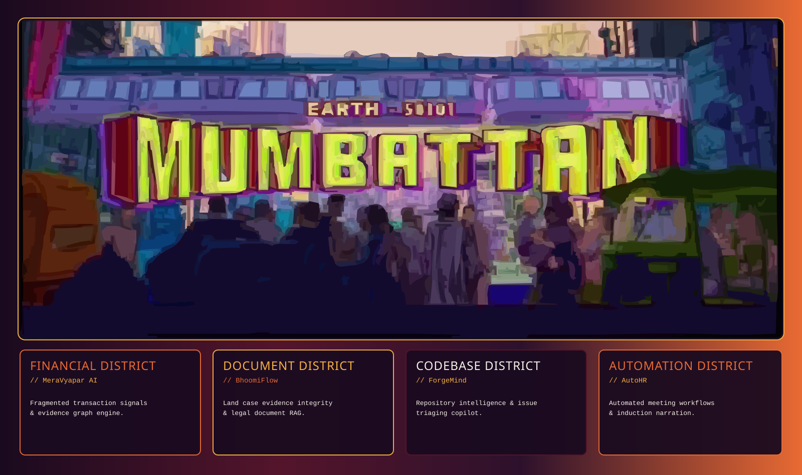

<!-- SCENE 08: GITHUB MULTIVERSE ACTIVITY -->

  

<!-- SCENE 09: CITYSCAPE BREATHING BREAK -->

  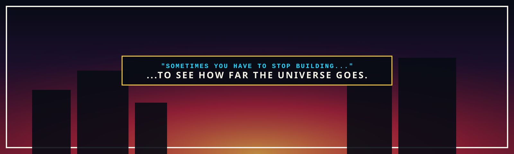

<!-- SCENE 10: FINAL POSTER & MULTIVERSE CONNECT -->

  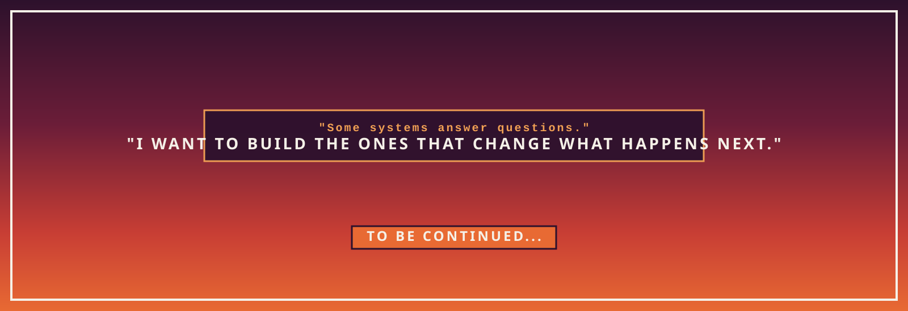

