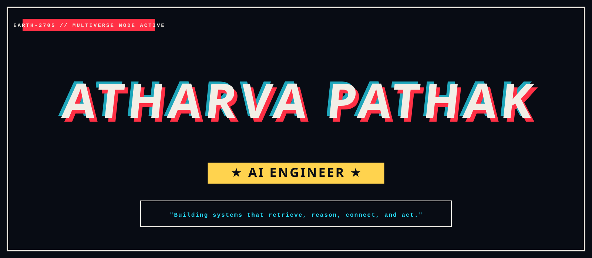

<!-- SCENE 00: COVER (ANIMATED HERO COVER WITH EMBEDDED OFFICIAL SPIDER-VERSE REFERENCE ARTWORK) -->

  

<!-- SCENE 01: ORIGIN (WITH EMBEDDED OFFICIAL SPIDER-MAN POSTER REFERENCE ARTWORK & TYPOGRAPHY HIERARCHY) -->

  

<!-- SCENE 02: THE BUILDER (WITH EMBEDDED OFFICIAL SPIDER-MAN HOMECOMING REFERENCE ARTWORK & CONCISE DOSSIER) -->

  

<!-- SCENE 03: THE MULTIVERSE (WITH EMBEDDED OFFICIAL SPIDER-VERSE WALLPAPER REFERENCE & ANIMATED STRANDS) -->

  

<!-- SCENE 04: UNIVERSES BUILT (CONCISE PROJECT CARDS & ANIMATED VECTOR PULSE) -->

  

  

  

  

<!-- SCENE 05: HOW THE MIND WORKS (CONCEPTUAL AGENTIC FLOW WITH ANIMATED DASH PIPELINE) -->

  

<!-- SCENE 06: MISSION CONTROL (CONCISE BUILDING TASKS & TERMINAL) -->

  

<!-- SCENE 07: MULTIVERSE CITY (WITH EMBEDDED OFFICIAL MUMBATTAN REFERENCE BACKDROP) -->

  

<!-- SCENE 08: CLOSING FRAME (WITH EMBEDDED OFFICIAL SPIDER-VERSE SUNSET REFERENCE & MULTIVERSE CONNECT) -->

  

 

  
  &nbsp;&nbsp;
  
  &nbsp;&nbsp;
  

  TO BE CONTINUED... 🕷️

