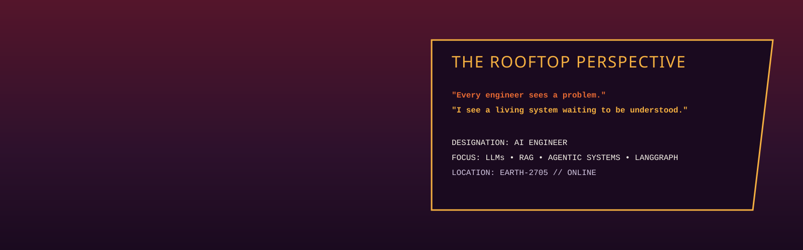
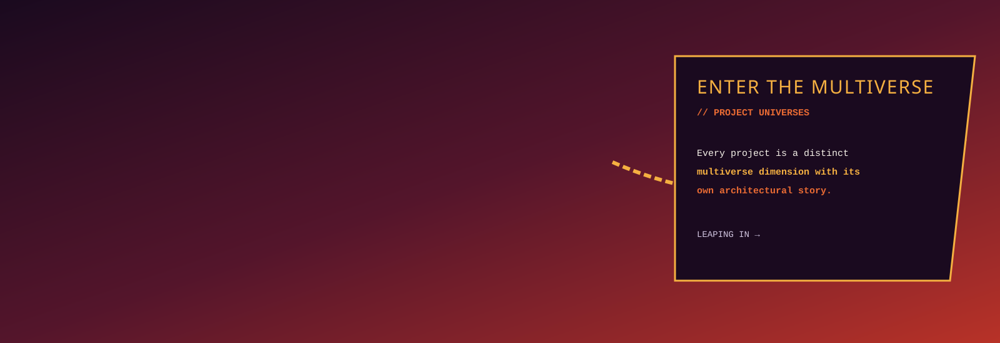

<!-- 01 — COVER SPLASH (REF SVG #1: Across The Spider-Verse Wallpaper.svg + CHAR #1: atharva-hero.svg INLINED) -->

  

<!-- 02 — COMIC STRIP (REF SVG #2: Spider Man Into The Spider Verse Poster.svg + CHAR #2: atharva-swing.svg INLINED) -->

  

<!-- 03 — OPEN CHARACTER MOMENT (REF SVG #3: Spider-Man Homecoming... PNG.svg + CHAR #3: atharva-rooftop.svg INLINED) -->

  

<!-- 04 — SPIDER-SENSE SPREAD (ENGINEERING POWERS & ANGLED CALLOUTS) -->

  

<!-- 05 — FULL-WIDTH MULTIVERSE SPLASH (REF SVG #4: Spider Man_ Across The Spider Verse Wallpaper.svg + CHAR #4: atharva-leap.svg INLINED) -->

  

<!-- 06 — PROJECT UNIVERSES (REF SVGs #5, #7, #8 INLINED) -->
<!-- UNIVERSE 01: MERAVYAPAR AI (REF SVG #5: download (4).svg INLINED) -->

  

  

<!-- UNIVERSE 03: FORGEMIND (REF SVG #7: download (5).svg INLINED) -->

  

<!-- UNIVERSE 04: AUTOHR (REF SVG #8: download (6).svg INLINED) -->

  

<!-- 07 — MISSION CONTROL (REF SVG #9: Bookmarks _ X.svg INLINED) -->

  

<!-- 08 — ACTION SEQUENCE & MULTIVERSE CITY (REF SVG #6: MUMBATTAN.svg INLINED) -->

  

<!-- 09 — CINEMATIC ENDING SPLASH (REF SVG #10: download (3).svg + CHAR #5: atharva-running.svg INLINED) -->

  

 

  
  &nbsp;&nbsp;
  
  &nbsp;&nbsp;
  

  TO BE CONTINUED... 🕷️

