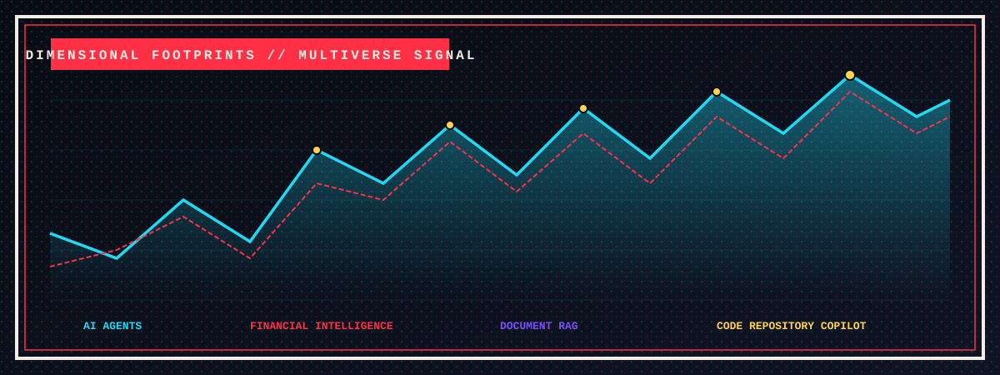

  

<!-- SCENE 01: ORIGIN STORY (WITH EMBEDDED OFFICIAL REFERENCE ARTWORK) -->

  

<!-- SCENE 02: CHARACTER DOSSIER (WITH EMBEDDED OFFICIAL REFERENCE ARTWORK) -->

  

<!-- SCENE 03: TECH MULTIVERSE MAP -->

  

<!-- SCENE 04: PROJECT UNIVERSES (PORTALS & ANIMATED VECTOR PULSE) -->

  

  

  

  

<!-- SCENE 05: AGENTIC AI PHILOSOPHY FLOW (WITH ANIMATED PIPELINE MOTION) -->

  

<!-- SCENE 06: MISSION CONTROL -->

  

<!-- SCENE 07: MULTIVERSE CITY & DISTRICTS (WITH EMBEDDED MUMBATTAN REFERENCE BACKDROP) -->

  

<!-- SCENE 08: GITHUB MULTIVERSE ACTIVITY FOOTPRINTS -->

  

<!-- SCENE 09: CITYSCAPE BREATHING BREAK (WITH EMBEDDED SPIDER-VERSE WALLPAPER BACKDROP) -->

  

<!-- SCENE 10: FINAL POSTER & MULTIVERSE CONNECT -->

  

