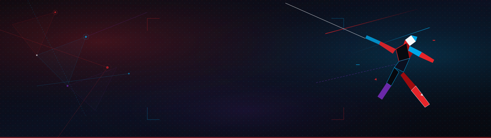
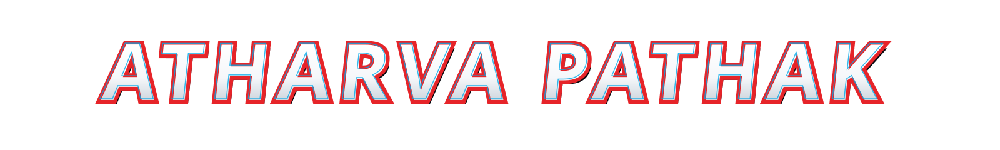

<p align="center">
  
</p>

<p align="center">
  
</p>

<p align="center">
  
</p>

<p align="center">
  <a href="https://readme-typing-svg.demolab.com">
    
  </a>
</p>

<p align="center">
  <em>Building AI systems that don't just generate answers — they retrieve, reason, connect, and act.</em>
</p>

<p align="center">
  
</p>

<!-- ASCII HERO EASTER EGG -->
<div align="center">
<pre>
                        |
                        |
                        |
                       / \
                      /   \
                     (  .  )
                     /|   |\
                    / |   | \
                   /  |___|  \
                  /  /     \  \
                 (  /       \  )
                  \/         \/
                  (  /\   /\  )
                   \/  \ /  \/
                       | |
                       | |
                      (   )
                       | |
                      /   \
</pre>
</div>

## 🕸️ ORIGIN STORY

Every engineer has an origin story.

Mine started with curiosity about how machines learn and evolved into building systems that can understand context, retrieve knowledge, reason through complex workflows, and assist humans with real-world decisions.

Today, I focus on building at the intersection of:

- **Large Language Models & RAG Architecture**
- **Agentic AI Systems & Multi-Agent Orchestration**
- **Stateful Workflow Engineering (LangGraph)**
- **High-Performance Production AI Engineering (FastAPI, Vector DBs)**

> *"Not all heroes wear capes. Some ship production systems."*

<p align="center">
  
</p>

## 🕷️ SPIDER PROFILE

```yaml
identity:
  name: "Atharva Pathak"
  alias: "Your Friendly Neighborhood AI Engineer"
  universe: "Earth-AI-2705"

specialties:
  - Agentic AI Systems & Multi-Agent Orchestration
  - Retrieval-Augmented Generation (RAG)
  - Production LLM Applications
  - Knowledge Graphs & Evidence Intelligence
  - High-Performance Retrieval Pipelines

currently_building:
  - Evidence-driven financial intelligence layers
  - Complex land case and evidence graph platforms
  - Open-source repository maintainer copilots

mission:
  "Build AI systems that solve real-world problems beyond the prompt."
```

<p align="center">
  
</p>

## 🧬 SUPERPOWERS

| Category | Capabilities & Core Stack |
| :--- | :--- |
| **🧠 AI INTELLIGENCE** | `LLMs` • `RAG` • `LangGraph` • `LangChain` • `Agentic AI` • `Embeddings` • `Vector Search` • `Prompt Engineering` |
| **⚙️ SYSTEM ENGINEERING** | `Python` • `FastAPI` • `PostgreSQL` • `Redis` • `REST APIs` • `Docker` |
| **☁️ DEPLOYMENT & DEVOPS** | `Google Cloud` • `CI/CD` • `GitHub Actions` • `Production Monitoring` |

<p align="center">
  
</p>

## 🕷️ CURRENT MISSIONS

### 💰 MERAVYAPAR AI
> **Financial Intelligence Layer**
- **Overview**: AI-powered financial intelligence designed to help merchants parse fragmented financial activity through evidence-driven transaction intelligence, receivables prioritization, payment promise tracking, and deep financial context.
- **Core Concepts**: Financial Intelligence Graph, Transaction Evidence Parsing, Receivables Intelligence, Agentic Financial Analysis.
- **Tech**: `FastAPI` • `LangGraph` • `PostgreSQL` • `RAG` • `Vector DB`

---

### 🌍 BHOOMIFLOW
> **Land Case & Evidence Intelligence Platform**
- **Overview**: Platform designed to structure complex land case information, legal documents, evidence relationships, procedural conflicts, and officer workflows into a unified intelligence graph.
- **Core Concepts**: Case Graph Architecture, Evidence Integrity, Document Intelligence, Conflict Detection, Procedure RAG.
- **Tech**: `Python` • `LangChain` • `Knowledge Graphs` • `FastAPI` • `Docker`

---

### 🤖 FORGEMIND
> **Open Source Maintainer Copilot & Contributor Mentor**
- **Overview**: AI agent assistant helping developers parse massive repositories, navigate codebase structures, triage open issues, and onboard contributors efficiently.
- **Core Concepts**: Repository Intelligence, Issue Analysis, Contributor Guidance, Codebase Graph Search.
- **Tech**: `LangGraph` • `Multi-Agent System` • `FastAPI` • `GitHub API`

---

### 🏢 AUTOHR
> **AI-Powered HR Automation & Induction System**
- **Overview**: System automating HR meeting workflows, presentation generation, audio narration, and automated employee onboarding experiences.
- **Tech**: `Python` • `LLMs` • `FastAPI` • `Workflow Automation`

<p align="center">
  
</p>

## ⚡ INTO THE AI MULTIVERSE

```
[ User / Client Query ]
          │
          ▼
┌──────────────────┐
│   AI Interface   │
└─────────┬────────┘
          │
          ▼
┌───────────────────────────────────────┐
│  Agent Orchestration (LangGraph)     │
└─────────┬───────────────────┬─────────┘
          │                   │
          ▼                   ▼
┌──────────────────┐┌───────────────────┐
│ Reasoning Engine ││ Vector Retrieval  │
└─────────┬────────┘└─────────┬─────────┘
          │                   │
          └─────────┬─────────┘
                    │
                    ▼
┌───────────────────────────────────────┐
│     Tools • Knowledge Graphs • APIs   │
└─────────┬─────────────────────────────┘
          │
          ▼
[ Real-World Action & Output ]
```

<p align="center">
  
</p>

## ⚡ SPIDER-SENSE ACTIVITY

<p align="center">
  <sub><i>"Signals detected across the developer multiverse."</i></sub>
</p>

<p align="center">
  
</p>

<p align="center">
  
</p>

<p align="center">
  
</p>

## 🌐 ENTER THE MULTIVERSE

<p align="center">
  <a href="https://linkedin.com/in/aspathak2705">
    
  </a>
  &nbsp;&nbsp;
  <a href="https://github.com/aspathak2705">
    
  </a>
  &nbsp;&nbsp;
  <a href="mailto:aspathak2705@gmail.com">
    
  </a>
</p>

<br />

<p align="center">
  <strong>"Somewhere between curiosity and production, great systems are built."</strong><br />
  <sub>Keep building. Keep shipping. Stay curious. 🕷️</sub>
</p>
